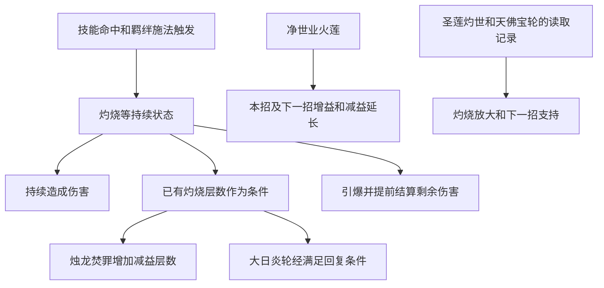

# 佛光与佛堂法术体系设计分析

在线阅读：[打开文档](https://chatgpt.com/space/page_db3e022132ac81919edfc654eafcd53c)

本文整理本会话中观察到的佛光普照、少林武学、佛门神通及佛门金焰法术，解释它们如何通过灼烧、层数、羁绊、出招顺序和试炼强化形成一套战斗体系。这里把用户所说的“佛光的所有法术”理解为佛堂相关法术体系，而不只是一招佛光普照。

核心判断是：这套体系以灼烧为共同条件，让不同招式分别承担状态施加、伤害放大、减益、引爆和回复，再用羁绊把六个技能槽连成循环。高阶金焰同时提高直接伤害和状态效率，改变了低阶法术的使用价值；低阶技能若要保留，必须证明其辅助收益足以补偿伤害损失。

整理日期为2026年10月2日。本文依据用户截图、会话内读取到的技能详情和战报记录；未取得游戏源码、官方完整技能表或统一环境测试。这是一份参考游戏的设计分析，不代表雾港已经采用或实现这些规则。

## 1 研究范围与证据等级

目前可识别的完整技能名称共11个：佛光普照、万佛朝宗、天佛降世、火凰葬仙诀、焚天浮屠塔、净世业火莲、大日炎轮经，以及四个金焰法术。另有天龙八音只在强化条目中出现。编辑器还有未读取名称和详情的图标，因此本文提供已知体系的完整分析，不把未见过的技能补写成官方全图鉴。

文中按以下方式区分证据：

| 标记 | 含义 | 使用边界 |
| --- | --- | --- |
| 截图确认 | 用户附件或本会话可见详情页直接写明 | 支持该页面当时显示的名称、数值和条件 |
| 读取记录 | 前段会话保留了技能详情摘要，本文没有完整原图可逐字复核 | 可用于角色分析，精细条件仍需复查 |
| 实战记录 | 一场结算页，或用户明确报告的胜负和伤害 | 只支持那一场，不证明跨楼层最优 |
| 设计推断 | 从上述规则推导出的结构和可能意图 | 不当成开发者原话或源码结论 |
| 待确认 | 页面缺失、结算语义不明或尚未做对照 | 不补造数值，不把假设写成事实 |

详情页左下角还显示交叉武器图标和数值，例如佛光普照的5009.2万、大日炎轮经的4.81亿、烛龙焚罪的17.84亿。**该数值的具体定义尚未确认**，不能直接叫作本场伤害或历史累计伤害。本文的伤害统计只使用结算页明确标为伤害统计的数据。

## 2 体系的整体设计思路

### 用共同状态建立技能之间的关系

灼烧一方面持续造成伤害，另一方面又作为其它技能的条件。烛龙焚罪根据目标已有灼烧层数增加减益层数；大日炎轮经立即结算灼烧剩余伤害，并在层数达到条件时回复气血；紫川神火的读取记录也包含灼烧引爆和随层数变化的生存收益。

因此，玩家面对的选择不仅是“哪招数字最大”，还包括“先制造什么状态、让谁利用、最后何时消耗”。在这一结构里，提前引爆可能让下一招失去条件；延后引爆则可能错过击杀和回复时点。状态自然结束并不意味着此前持续伤害消失，问题是还能提前结算多少剩余伤害，以及结算时机是否有用。

### 让六个槽位承担不同工作

六槽限制把组合设计变成资源分配。玩家要同时安排直接伤害、状态来源、放大效果、终结结算和生存功能。羁绊要求又进一步限制技能所属类别，避免六格都按单招伤害自由拼接。

在当前用户明确选择的方案中，四个新金焰法术全部保留，余下两格用于选择高阶配套技能，并激活第二个羁绊。这是本轮研究的阵容约束，不是已证实的全游戏最优解。

### 用高阶法术升级整条循环

金焰法术已经显示5168%、5472%或6080%的直接攻击倍率，冷却通常为12秒。它们还附带下一招增益、灼烧放大、减益或引爆生存收益。高阶替换因此同时影响技能本体与整套状态循环。

设计推断：成长目标是让玩家从低阶的“附带一点灼烧”逐步进入“每次施法都为其它技能创造条件”的玩法。倍率增长保证新法术有明显获得感，联动条件保留组合研究的空间。

## 3 羁绊如何成为第二层技能系统

羁绊既给属性，也可能直接给施法触发效果。它不是只显示在面板上的加成，而可能是整个循环最稳定的状态来源。

| 羁绊 | 已观察的等级和计数 | 页面显示的效果 | 证据 |
| --- | --- | --- | --- |
| 少林 | 1级1/2，未达激活数量 | 少林武学及佛门神通伤害提升10%，灼烧伤害提升12% | 最新编辑器截图 |
| 少林 | 早段2级6/4 | 少林武学及佛门神通伤害提升20%，灼烧伤害提升24% | 用户早段截图 |
| 佛门 | 1级2/4，已激活且尚未达到下一档 | 少林武学及佛门神通伤害提升10%；释放相应武学或神通后施加1层灼烧，每秒造成攻击100%的伤害，持续2秒 | 会话中编辑器截图 |
| 佛门 | 最新1级1/2 | 对应效果仍可在面板预览，但数量未达到激活条件 | 最新编辑器截图 |
| 佛门金焰 | 2级4/4 | 少林武学及佛门神通伤害提升20%；释放任意武学或神通后施加1层金焰，每秒造成攻击400%的灼烧伤害，且受到灼烧伤害提升20%，持续2秒 | 最新编辑器截图 |

上述计数显示的是当前数量及该档或下一档门槛。1/2意味着尚未激活；2/4可以是已激活1级、继续追求4个的状态。必须结合等级、颜色和计数读取，不能把面板列出的每一行都算作已生效。

### 四个金焰固定后为什么余下两格要同系

最新截图是金焰4/4、少林1/2、佛门1/2。这代表四个金焰形成一条有效羁绊，而余下两招分属两系，分别差一个，未形成第二条有效羁绊。

在四金焰占满四格的前提下，剩余两格需要同属少林或同属佛门，才能达到第二条羁绊的数量门槛。不能用“有三行羁绊说明”代替“有两个羁绊已激活”。

### 羁绊的价值为什么可能超过一招的面板差距

佛门金焰2级把每次施法变成金焰来源。若一层完整结算2次、每次400%，名义上就是800%攻击的持续伤害，再附带灼烧易伤条件。这个计算只表示单层完整持续的名义量，不证明它一定命中所有敌人或完整结算。

仍需确认金焰施加给哪些目标、层数上限、刷新方式、易伤是否按层叠加，以及两条羁绊的伤害加成如何相加或相乘。面板写“受到灼烧伤害提升20%”时，描述的是受伤一方的易伤效果，不能直接改写成玩家面板上的灼烧伤害率加20%。

设计推断：羁绊让普通技能也参与高阶状态循环，使阵容身份比单招排名更有意义。

## 4 状态和结算的共同语言

| 状态或机制 | 已知作用 | 对组合的意义 | 尚未确定的规则 |
| --- | --- | --- | --- |
| 灼烧 | 持续伤害；可有层数；可被引爆结算 | 同时是伤害来源和其它技能的条件 | 各来源是否共用层数、叠层上限、刷新和会心规则 |
| 佛炎 | 万佛朝宗施加；持续伤害并降低会心率 | 将输出和生存减益合在同一招 | 是否被“灼烧层数”条件识别 |
| 金焰 | 金焰羁绊施加；400%每秒、2秒，并附灼烧易伤 | 高频施法可持续提供高阶状态 | 易伤叠加、目标范围、是否参与全部引爆 |
| 焚罪 | 烛龙焚罪施加；降低会心率和会心伤害 | 用已有灼烧转换出更强生存减益 | 层数如何影响12%数值、刷新和叠加方式 |
| 增益及减益延长 | 净世业火莲会延长本招及下一招施加的相应效果 | 对顺序敏感的辅助能力 | 能否延长各类持续伤害、与专属延长的合成方式 |
| 灼烧引爆 | 大日炎轮经立即结算剩余灼烧伤害；紫川有相关读取记录 | 让剩余状态伤害提前兑现 | 是否移除状态、引爆哪些状态、伤害归属 |
| 回复和免疫 | 大日有条件回复和驱散；紫川记录有层数相关回复及免疫 | 把进攻准备转化为生存能力 | 回复频率、免疫持续时间、是否受到增益延长 |

不能仅凭名称把灼烧、佛炎、金焰和焚罪当成同一种状态。文案使用不同名称，可能对应不同结算类别；它们之间的互认关系决定许多组合是否真正成立。

下面只表示已经观察到的条件关系，不表示所有状态共用同一套层数：

## 5 少林技能的设计角色

### 佛光普照

**截图确认：**八阶五重，类别少林，冷却11秒。对3个目标造成819%攻击伤害，施加2层灼烧，使目标每秒受到120%攻击的灼烧伤害，并降低攻速15%，持续3秒。

它的组合身份很清楚：一次攻击同时承担群体伤害、灼烧施加和攻速抑制。攻速降低让敌人的输出节奏变慢，灼烧又可为后续条件型技能服务，属于带生存功能的持续型技能。

其不足同样明确：当前直接倍率和阶数远低于金焰主力。即便把持续部分算进去，也不能只用旧战报中的较高占比来认定它值得占用当前槽位。若120%是每层每秒倍率，2层持续3秒的名义持续量为720%；若120%指状态合计，则为360%。层数结算需验证，不能把前一种算法默认为官方总伤害。

对当前阵容的结论是：**撤回把佛光普照作为高阶替换方案的推荐。**要重新考虑它，至少需要在同一楼层证明灼烧条件、生存收益或羁绊收益足以抵消直接伤害缺口，目前没有这项证据。

### 万佛朝宗

**截图确认：**八阶五重，类别少林，冷却12秒。对4个目标造成1309%攻击伤害，施加2层佛炎；佛炎每秒造成攻击150%的灼烧伤害，并降低会心率15%，持续3秒。

它比佛光普照有更大的目标覆盖，并把生存方向从减攻速改为减会心率。相同的“持续伤害加减益”结构给同系技能留下风格差异，玩家可以针对敌人伤害来源进行选择。

佛光与万佛同属少林，可在数量上形成少林的另一条羁绊；但这不等于适合当前高阶挑战。二者都是已见8阶技能，不能只为了第二条羁绊而忽视用户要求的高阶优先。

## 6 佛门技能的设计角色

### 净世业火莲

**截图确认：**十一阶五重，类别佛门，冷却12秒。对4个目标造成2448%攻击伤害；本招及下一招武学或神通施加的增益持续时间延长50%，减益持续时间延长50%。

它是一张具有明确顺序要求的辅助输出技能。玩家需要先辨认下一招依靠什么增益或减益，再把火莲安排在它前面。收益可能体现在敌人的负面效果、己方的支持效果或生存窗口，而不一定全部记在火莲自己的伤害条上。

它与金焰体系存在值得验证的配合：延长金焰相关增减益、延长烛龙焚罪，或延长宝轮、圣莲施加的支持效果。**这些具体互作尚未全部验证**；不能把“增益和减益延长”无条件视为所有灼烧都延长。

它也是一个需要认真算辅助收益的候选。2448%低于当前金焰的直接倍率，只有在延长确实有效且作用于关键效果时，辅助价值才可能弥补差距。

### 大日炎轮经

**截图确认：**十一阶五重，类别佛门，冷却12秒，特性为爆发和回复。对3个目标造成2880%攻击伤害，立即引爆目标的灼烧状态，结算剩余伤害；引爆的灼烧状态数量大于2层时，按每个目标单独计算，恢复自身攻击600%的气血，并额外驱散自身1层减益。

它体现了这套系统最完整的一次转换：前面施加的持续状态被变为即时伤害，层数又决定回复是否触发，随后再清除负面效果。单招同时连接输出资源、生存条件和异常管理。

这里的“大于2层”是超过2层，不能写成达到2层。按目标单独计算意味着对多个满足条件的目标施放时，回复可能受命中目标及各自层数影响；实际是否存在次数限制仍需确认。

顺序上它适合在关键技能已经使用灼烧条件后再引爆。若提前施放并清除状态，可能削弱后续烛龙或另一张引爆技能的收益。

### 焚天浮屠塔

名称、已装备记录和伤害条已确认；本次资料没有完整详情页，无法给出可靠的当前倍率、冷却、阶数和逐条机制。

在会话内的一套编辑器配置中，大日炎轮经与浮屠塔并用时显示佛门1级2/4。这支持浮屠塔参与当时的佛门计数。它在后段失败战报中贡献10.29%，在较早38.8万胜利记录中贡献21.21%；只能确认它在这些具体战斗中有输出贡献。

从“塔”的名称和图标可以推断其表现适合稳定压制或持续区域效果，但**实际技能机制不能从名称推定**。本文件不会把“塔负责铺灼烧”写成已确认规则。

### 火凰葬仙诀

名称、装备记录和战报贡献已确认；完整详情缺失。早段实战贡献为22.81%，后段一次失败战报为1.63%。两次结果差异提示其价值受阵容和战斗环境影响，但没有足够信息判定原因。

此前策略曾把它用于灼烧准备或会心支持，当前资料不足以逐字核对该效果。因此，它的类别、倍率、支持效果和触发条件需要重新读详情，不能沿用未经复核的顺序解释。

### 天佛降世

已在较早六招配置和战报记录中出现，伤害占比为0.56%。阶数、类别标签、冷却和效果没有可靠详情可用。

低直接伤害可能意味着它偏辅助，也可能来自施放次数、统计归属或该场战斗条件。不能据此直接断言技能本身无用，也不能假定它有某项强辅助效果。

## 7 四个金焰法术的设计角色

四个技能此前读取记录均为十三阶五重、类别佛门金焰、冷却12秒。它们共同形成用户要求保留的高阶核心。以下把详细截图确认与早段读取摘要分开。

### 金焰·烛龙焚罪

**截图确认：**对2个目标造成6080%攻击伤害，施加2层焚罪，降低会心率及会心伤害12%，持续6秒。目标身上每有1层灼烧，额外施加1层，页面写最多施加4层；技能结束后还写有100%概率额外施加1层。

这张牌把较少的命中目标数换成较高的单目标倍率，并利用已有灼烧层数强化减益。它的主要状态是焚罪，作用是抑制敌人会心输出。**不能把增加焚罪层数改写成增加灼烧层数。**

“最多4层”与技能结束后额外1层如何共同结算，以及末尾额外层数的完整对象，需要复查完整文案或实测。降低12%如何随焚罪层数计算也未确认，不能直接写作4层降低48%。

设计推断：它是在持续伤害体系中放入一张进攻兼防守的高倍率技能，让叠灼烧的准备也能换来生存收益。

### 金焰·天佛宝轮

**读取记录：**对5个目标造成5168%攻击伤害，目标有灼烧时会支持下一招，并附带金焰相关持续伤害。完整增益数值、判定目标、作用次数及条件需要复核。

它在体系中承担群体覆盖和相邻招式支持。五目标覆盖对多敌战斗有意义，面对只有三个敌人的战斗时不能把五目标倍率全算满。下一招支持使玩家必须关心它与哪张技能相邻。

红色强化曾被记录为本招冷却减少5秒。这可能提高它的施放频率，同时带来更多羁绊触发和下一招支持窗口。后段战报中它占38.17%，但尚不能证明这完全由减冷却造成。

### 金焰·紫川神火

**读取记录：**对3个目标造成5472%攻击伤害，包含灼烧引爆，并根据层数获得回复和免疫收益。精确回复倍率、免疫时间和引爆范围尚未复核。

它可以理解为高阶的终结及生存转换技能：把已经形成的状态资源结算成即时伤害，同时将资源准备转化为防护。与大日炎轮经相比，二者都涉及灼烧引爆，因此是否互相消耗条件是组合的关键问题。

不能仅凭名称假定它的紫色表现意味着另一个异常结算类别；伤害类别应以技能文字和实际规则为准。

### 金焰·圣莲灼世

**读取记录：**对3个目标造成5472%攻击伤害，涉及提升灼烧伤害或状态持续时间，并与目标已有灼烧状态关联。具体幅度、适用对象和条件需复核。

它承担高阶灼烧放大及状态维护的角色。设计上可以让玩家先准备状态，再通过圣莲提高后续技能或持续伤害的收益，而不是每一张牌都直接引爆。

这张牌为何适合放在某一张引爆技能之前，最终取决于其放大效果在施法前后何时生效、是否要求目标预先有灼烧，以及引爆能否继承该加成。当前只能提出顺序假设，不能给出已验证的固定最优顺序。

## 8 技能目录和数值比较

### 已知技能目录

| 名称 | 已见阶数及类别 | 直接倍率及目标数 | 冷却 | 资料完整性 |
| --- | --- | --- | --- | --- |
| 佛光普照 | 8阶五重 少林 | 819%，3目标 | 11秒 | 详情截图确认 |
| 万佛朝宗 | 8阶五重 少林 | 1309%，4目标 | 12秒 | 会话详情截图确认 |
| 净世业火莲 | 11阶五重 佛门 | 2448%，4目标 | 12秒 | 会话详情截图确认 |
| 大日炎轮经 | 11阶五重 佛门 | 2880%，3目标 | 12秒 | 会话详情截图确认 |
| 焚天浮屠塔 | 佛门计数记录，当前阶数待读 | 待确认 | 待确认 | 有装备和战报，缺详情 |
| 火凰葬仙诀 | 当前类别和阶数待读 | 待确认 | 待确认 | 有装备和战报，缺完整详情 |
| 天佛降世 | 待确认 | 待确认 | 待确认 | 有早段战报，缺详情 |
| 金焰·烛龙焚罪 | 13阶五重 佛门金焰 | 6080%，2目标 | 12秒 | 详情截图确认 |
| 金焰·天佛宝轮 | 13阶五重 佛门金焰 | 5168%，5目标 | 12秒 | 早段读取记录 |
| 金焰·紫川神火 | 13阶五重 佛门金焰 | 5472%，3目标 | 12秒 | 早段读取记录 |
| 金焰·圣莲灼世 | 13阶五重 佛门金焰 | 5472%，3目标 | 12秒 | 早段读取记录 |

天龙八音仅在“龙音震天”强化中被提及，不能据此补出技能本体的类别、等级或倍率。

### 高阶替代为什么会很明显

只比较相同三个目标、直接命中部分，5472%对819%的倍率比约为6.68倍；再考虑12秒对11秒冷却，名义直接伤害频率之比约为6.12倍。这里排除了灼烧、辅助、会心、防御和实际施放限制，不能把它叫作最终实战伤害之比，但足以说明低阶替换的基础成本很高。

低阶辅助若要保留，必须增加其它五招的有效伤害、保证更多施放轮次，或用生存收益直接改变胜负。理由不能停在“它以前在伤害表里排第一”。

### 目标数量也属于伤害预算

下面以战斗画面曾出现的三个敌人为例，只计算每招直接攻击的名义总倍率。假设技能命中三个现存目标，二目标技能则最多计算两个；不计持续、引爆、会心和防御。

| 技能 | 三敌场景的名义直接总倍率 |
| --- | --- |
| 佛光普照 | 819% × 3 = 2457% |
| 万佛朝宗 | 1309% × 3 = 3927% |
| 净世业火莲 | 2448% × 3 = 7344% |
| 大日炎轮经 | 2880% × 3 = 8640% |
| 金焰·烛龙焚罪 | 6080% × 2 = 12160% |
| 金焰·天佛宝轮 | 5168% × 3 = 15504% |
| 金焰·紫川神火 | 5472% × 3 = 16416% |
| 金焰·圣莲灼世 | 5472% × 3 = 16416% |

这说明五目标技能在三敌场景有未使用的覆盖能力，二目标技能又可能留下第三个敌人。设计者用命中数量、单体倍率和附加机制分配强度；玩家不能只对比某一个百分比。

## 9 顺序设计如何影响同一套技能

### 可以确定的顺序约束

净世业火莲明确影响下一招，因此必须放在需要延长效果的技能前面。大日炎轮经引爆剩余灼烧，因此要考虑它是否消耗后续技能的层数条件。要获得烛龙焚罪根据灼烧额外增加的减益层数，准备状态的技能或羁绊触发要发生在它之前；它的本体伤害和基础焚罪并不以已有灼烧为施放前提。宝轮的读取记录含下一招支持，因此应测试相邻技能。

这些是关系约束，不等于已经有一张完整且唯一的最优顺序表。

### 四金焰核心的候选链条

基于当前读取记录，可以提出一条待测试链条：先施加灼烧，再用圣莲放大或维护状态，宝轮支持下一招，烛龙利用灼烧加强减益，紫川在后段引爆并获取生存收益。

另一种候选是让宝轮直接支持紫川，因为紫川除了本体5472%之外可能还结算引爆伤害。若宝轮支持能影响引爆，这种相邻关系可能比支持6080%的烛龙更好；若只能影响本体，结论又可能不同。

必须验证圣莲是否需要先有灼烧、宝轮究竟加强什么、紫川如何消费状态，才能把候选链条变成推荐顺序。

### 双引爆为什么可能相互干扰

若大日和紫川都会移除同一批灼烧，连续施放可能让第二招缺少资源。合理方案可能是把两次引爆分开，中间用其它招式或羁绊重新施加状态；也可能需要只保留一张引爆，把另一个槽位给状态放大或覆盖能力。

这是一项机制推断。不能在未确认引爆是否移除状态之前，把“双引爆一定冲突”写成结论。

### 名单相同也不代表结果相同

顺序会改变状态层数、增益覆盖、减益覆盖和回复时点。敌人死亡时点还会改变下一招的实际目标数。技能相同但排序不同，有可能得到完全不同的输出结构和生存时长。

可复现的测试必须同时记录六招名称、完整顺序、阶数、羁绊与强化，不能只记六个图标。

## 10 强化词条的设计层次

试炼中的三选一词条至少包含通用伤害、固定异常伤害、生存属性、会心、专属伤害、专属持续时间和专属冷却。它们并非只按蓝橙红颜色排列一个统一强弱榜，而是修改不同部分的战斗模型。

| 已见词条 | 页面或记录中的效果 | 它改变的部分 |
| --- | --- | --- |
| 铁火焚天 | 灼烧伤害率加5% | 灼烧类伤害系数 |
| 铁眼洞微 | 会心率加5% | 可会心伤害的期望值 |
| 铁锋裂甲 | 会心伤害加5% | 已发生会心时的伤害 |
| 铁邪御魂 | 异常固定伤害加1000，武学伤害减免加8% | 异常结算及生存 |
| 铁邪破招 | 异常固定伤害加2000，武学伤害减免加10%，破招率加5% | 异常结算、生存和破招 |
| 神火御体 | 灼烧伤害率加8%，武学伤害减免加8% | 进攻和防御混合 |
| 神邪御体 | 异常伤害率加8%，武学伤害减免加8% | 异常体系进攻及防御 |
| 龙音震天 | 天龙八音伤害提升50% | 指定技能的伤害 |
| 烛龙焚罪专属红色词条 | 金焰·烛龙焚罪减益持续延长50% | 焚罪等该招减益的覆盖时间 |
| 天佛宝轮专属红色词条 | 冷却减少5秒 | 施放频率；来自前段记忆记录，仍需原图复核 |

### 烛龙红词条主要延长减益

最新截图明确写“减益持续延长50%”。烛龙已确认的焚罪是降低会心率和会心伤害的减益，因此这条强化首先应理解为提高减益覆盖，而不是增加灼烧伤害50%。

如果基础6秒直接乘1.5，名义持续时间会到9秒。以12秒冷却且无其它限制为例，覆盖率由50%变成75%，增加25个百分点。这个算例依赖简单延长和稳定命中，不确认与其它延长效果的叠加规则。

它可能通过降低敌人的会心伤害帮助玩家多活一轮，间接提高总伤害，但不能从词条本身断言本场总伤害增加50%。

### 宝轮减冷却可能同时改变伤害和触发频率

若12秒冷却被直接减少5秒，名义冷却是7秒，理论施放频率提高约71.4%。实际提高多少取决于动作时间、自动施法调度、技能轮转、资源限制和战斗时长；不能保证最终伤害提高71.4%。

更深一层的收益来自每次施法可能继续触发金焰，并带来更多下一招支持。这让减冷却有机会成为体系型强化，而不只是单招属性。

### 通用灼烧加成与会心加成怎样比较

灼烧伤害率加5%的收益取决于现有加成和灼烧在总伤害中的比重。若它是加算，现有灼烧加成20%时，再加5%的相对增幅是1.25除以1.20，约4.17%，还要乘以适用伤害占比。

会心率和会心伤害也需看基础值。若把会心额外伤害倍率记为C，会心率记为r，简化期望倍率为1加r乘C。加5%会心率与加5%会心伤害的收益取决于r和C；灼烧是否能会心、减益是否影响敌人还是自己，也必须分别判断。

因此，“当前偏灼烧”支持优先考虑灼烧词条，但不能在未知会心和伤害归属规则时宣布它永远优于会心。

### 防御词条是否有效取决于失败原因

若玩家先被击败，武学伤害减免、焚罪覆盖、回复和免疫可能让关键高阶招式多释放一轮。若玩家一直存活却到时未杀完，防御收益可能很小。

铁邪破招同时给固定异常伤害、10%武学减免和5%破招，在生存受限时可能优于一个专属减益延长。破招的完整定义、异常固定伤害的触发频率和敌人伤害类别尚未确认，无法给出统一排序。

用户要求记住的两条红色强化是烛龙减益延长50%和天佛宝轮冷却减少5秒。它们是待保留及复核的选择记录，不是已确认最优的一对。

## 11 试炼成长如何引导玩家重组阵容

会话中观察到爬层、解锁新技能、强化三选一、编辑六招和重置入口，用户也报告过39层、49层、51层等阶段进度。界面在部分楼层写有“获得强化词条”，但现有资料不足以给出固定发放周期。

设计推断：这个循环让阵容不是一次配好就永久使用。新阶数带来基础伤害跃升，新羁绊改变状态来源，专属强化提高部分技能的价值，后续关卡再检验组合是否能维持输出和生存。

这种设计能产生三类决策：

1. 新法术是否足以替换旧的主力，还是需要先凑够同系数量。
2. 已有词条应围绕当前核心继续累积，还是在重置后改变方向。
3. 遇到瓶颈时，改名单、改顺序或改强化，哪个能以最小损失解决问题。

游戏界面在编辑器中同时显示羁绊、六个已选槽和候选技能，有助于玩家看见组合约束。风险是图标和颜色容易被误当成完整的强度信息，玩家可能没有打开详情就把低阶技能选进高阶阵容。

重置的资源成本、保留内容、词条随机性和可重复性尚未确认，本文不假定重置免费，也不建议依据未经证实的组合结论立即重置。

## 12 实战记录能说明什么

### 较早38.8万胜利记录

以下来自前段会话保存的胜利记录；当时使用六个普通相关技能，并非当前四金焰核心。用户报告已经通过该轮，记录对应75层阶段。

| 技能 | 当场伤害占比 |
| --- | --- |
| 净世业火莲 | 15.01% |
| 火凰葬仙诀 | 22.81% |
| 焚天浮屠塔 | 21.21% |
| 大日炎轮经 | 14.14% |
| 天佛降世 | 0.56% |
| 佛光普照 | 26.27% |

它证明这些技能在该轮有对应伤害归属。不能因此得出“佛光普照在后续高阶阵容仍然最强”。阶数、敌人、其它技能、羁绊、强化和状态统计归属都已改变或尚未完整记录。

### 后段126.4万失败战报

本会话可见失败结算写明总伤害126.4万。结果页没有可靠记录该场楼层；塔图显示92至94层，不足以把它直接认定为94层失败。

| 技能 | 当场伤害占比 |
| --- | --- |
| 火凰葬仙诀 | 1.63% |
| 焚天浮屠塔 | 10.29% |
| 金焰·圣莲灼世 | 19.24% |
| 金焰·天佛宝轮 | 38.17% |
| 金焰·烛龙焚罪 | 15.69% |
| 金焰·紫川神火 | 14.97% |

四个金焰合计88.07%，两个普通技能合计11.92%；四舍五入后总和99.99%。这表明该场的可见伤害归属已经明显集中在金焰核心。火凰的1.63%值得复查，但不能单凭这个数字确定它没有提供任何辅助收益。

### 两场伤害条不构成跨版本技能排名

总伤害、阵容、阶段和目标环境不同，伤害占比是相对量。某一招占比下降，可能是其它技能增长更快；占比上升也可能是别的技能未正常发挥。引爆和持续伤害记给谁，又可能改变榜单。

要比较替换效果，应在同一关卡、同一技能阶数、同一强化和同一顺序下，只更换一个槽位，并记录胜负、结束时间、剩余敌人、玩家生存时间及总伤害。

### 关于第92层测试的结算边界

会话后段确实看到自动战斗页显示第92层、三个敌人，并出现剩余时间50秒或48秒。一次点击跳过后返回塔图；另一次观察时镜像已经转到商店，没有保留下明确胜负结算。

因此只能记录“发起过第92层挑战”，不能记作已经通过92层或推进到93层。镜像随后也显示iPhone使用中并断开，候选详情的进一步核对尚未完成。

## 13 当前选型应该怎样重新判断

先固定用户本轮要求：四个新金焰全用，激活两个有效羁绊，配套招式优先选择高阶。最新截图中装入佛光普照后，少林和佛门各1/2，既不满足第二个有效羁绊，又存在819%直接倍率的明显差距。

可行的选型流程是：

1. 读取剩余候选的当前阶数、倍率、目标数、冷却和类别标签，尤其补齐浮屠塔与火凰的详情。
2. 从同系配对中筛选能激活第二个羁绊的组合，不把两张分属两系的单卡当成两条已激活羁绊。
3. 先比较基础伤害和覆盖能力，再比较对四金焰的支持收益及生存收益。
4. 用同一关卡检验，先固定名单再改顺序，避免同时更改多项而无法归因。
5. 只有在当前名单及机制已确认后，再决定是否重置专属强化。

大日炎轮经和净世业火莲已确认是11阶佛门技能，但其直接倍率分别为2880%和2448%。现有资料没有证明剩余两格一定存在两张均超过4000%且同系的候选，不能虚构这样的配对来满足预期。

**当前没有证据支持一个已经验证的最优六招名单或固定顺序。**可以确认的是：佛光普照不是本轮合适的高阶替换建议；四金焰核心输出已经占主导；第二羁绊的两张配套必须一起考察。

## 14 美术命名怎样对应机制身份

用户截图能确认卡面符号及部分战斗表现，但没有逐招完整录像。以下是名称与已知机制的设计解读，不是对游戏全部特效的验收。

| 招式身份 | 已知或记录中的机制 | 适合传达的视觉信息 |
| --- | --- | --- |
| 佛光普照 | 多目标灼烧及攻速抑制 | 光照覆盖与附着在目标上的持续状态 |
| 万佛朝宗 | 多目标佛炎与会心抑制 | 威压感及持续的目标减益 |
| 净世业火莲 | 下一招增减益延长 | 莲的展开及能连接到后续招式的持续痕迹 |
| 大日炎轮经 | 灼烧引爆、回复、驱散 | 聚集后迅速结算，随后回收为回复与净化 |
| 金焰·烛龙焚罪 | 二目标高倍率及焚罪减益 | 明确的龙形打击身份和减益附着 |
| 金焰·天佛宝轮 | 群体覆盖及下一招支持 | 轮的运转及后续技能被支持的提示 |
| 金焰·紫川神火 | 引爆及层数相关生存收益 | 爆发、状态消耗及回复或免疫的清晰转换 |
| 金焰·圣莲灼世 | 灼烧放大和状态维护记录 | 莲的扩展和持续火势增强 |

设计推断：佛、莲、轮、塔、龙和火凰提供共同文化语汇，但每个符号应对应不同的动作和机制。若技能名称不同、卡面不同，实际命中和状态反馈却几乎一样，玩家仍然难以识别招式工作。

对这种状态体系，特效除了好看，还需要回答三件事：状态有没有施加成功、目标当前有哪些层数、引爆是否消费了这些状态。高倍率命中、生存免疫和状态延长也应各自有可辨认反馈。

## 15 这套设计的优点和风险

### 值得保留的设计结构

共同状态让输出、生存和技能顺序发生关系。同一次灼烧准备可以支持直接持续伤害、烛龙减益层数和引爆后的回复，玩家的准备行为因此有多个回报。

羁绊把技能身份转成施法触发规则，让数量门槛改变整套循环。高阶技能又同时提升倍率和联动效率，玩家获得新技能时能明显感到阵容结构发生变化。

专属延长和减冷却分别改变覆盖率与施放频率，使强化选择不只是继续加攻击。六槽约束让玩家必须在同系、主力伤害、状态支持和生存能力之间取舍。

### 高阶数值差距可能使旧技能退出

819%对5472%的直接差距很大。如果低阶技能的支持机制不能持续升级，就会很快退出选择空间。玩家可能只剩“新四张全部用、研究另外两格”，而不是长期保留许多可竞争方案。

这不是从现有截图就能判定的全游戏平衡问题，但当前用户的实际选择已经呈现这种倾向。需要检查低阶支持技能是否有随进度成长的辅助强度，而不是仅保留低阶伤害。

### 羁绊门槛可能形成结构锁定

四个金焰加两个同系技能占满六格。如果这是主要高阶解，玩家实际的自由选择只剩同系两张和顺序。新技能类别若不能与现有门槛兼容，可能很难进入阵容。

### 状态归属可能误导战报解释

羁绊伤害、引爆剩余伤害、持续伤害和下一招增幅如果都归到触发技能名下，战报条会显得像某一张牌异常强。辅助技能的收益又可能被统计给另一张牌。

在没有统计规则说明时，应把伤害条当成该场的结果观察，避免把它直接作为技能强度排行榜。

### 文字细节可能改变全部决策

“减益延长”与“灼烧延长”不同，“下一招”与“全部后续技能”不同，“超过2层”与“达到2层”不同，“每层伤害”与“合计伤害”不同。当前研究中的误判主要就来自这些细节，以及把旧战报排名带到新阶数环境。

## 16 需要补齐的规则和验证

以下缺口直接影响设计理解和实际组合，不是为了扩大工作范围而添加的测试：

| 问题 | 为什么影响结论 | 最少需要的证据 |
| --- | --- | --- |
| 浮屠塔和火凰的完整当前详情 | 决定高阶配套候选、同系计数及顺序作用 | 当前详情截图 |
| 宝轮、紫川和圣莲的完整条件及增益数值 | 决定四金焰的相邻顺序和引爆收益 | 当前详情截图 |
| 灼烧、佛炎、金焰的层数互认 | 决定条件技能能否利用各来源 | 单一来源及混合来源的对照 |
| 引爆是否移除状态及引爆类别 | 决定双引爆是否冲突 | 引爆前后状态图标及伤害变化 |
| 焚罪12%如何随层数结算 | 决定烛龙的防御价值 | 不同层数时的明确属性或结算 |
| 延长词条的叠加和刷新 | 决定6秒是否到9秒及与净世如何配合 | 只改一项延长的持续时间对照 |
| 宝轮减冷却后的实际施放频率 | 决定强化是否产生理论频率收益 | 统一时长内施放次数 |
| 两条羁绊加成的适用范围和叠加 | 决定面板增益在金焰与普通技能上如何生效 | 只改变一条羁绊的对照 |
| 异常固定伤害、破招及会心规则 | 决定通用词条选择 | 对应说明页或可归因结算 |
| 战报把持续、引爆和羁绊伤害记给谁 | 决定技能占比能否用于替换判断 | 同技能与单一状态来源的对照 |
| 当前失败原因 | 决定强化应优先输出还是生存 | 结束时间、玩家气血、敌人剩余气血 |
| 重置成本与保留范围 | 决定能否低成本更换强化路线 | 重置说明或确认页文字 |

后续每场记录建议保留：目标楼层与敌人数、六招及顺序、当前阶数、已激活羁绊及数量、完整强化、胜负、结束原因、剩余时间、总伤害和玩家生存时长。固定这些信息，才能区分伤害不足、覆盖不足、提前死亡和顺序冲突。

## 17 资料来源与修正记录

### 用户提供的主要截图

| 资料 | 原始截图 | 支持的事实 |
| --- | --- | --- |
| 佛光普照详情 | [打开截图](evidence/foguang-detail.png) | 8阶少林、819%、11秒、2层灼烧及攻速降低 |
| 当前羁绊与六槽编辑器 | [打开截图](evidence/bond-editor.png) | 金焰4/4，少林1/2，佛门1/2 |
| 烛龙专属红色强化三选一 | [打开截图](evidence/zhulong-red-trait.png) | 减益持续延长50%；铁邪破招和铁锋裂甲的效果 |
| 灼烧及会心等强化三选一 | [打开截图](evidence/generic-trait-choice.png) | 铁邪御魂、铁眼洞微、铁火焚天的效果 |
| 强化列表 | [打开截图](evidence/selected-traits.png) | 神火御体、龙音震天、神邪御体的效果 |

另有本会话可见的技能详情读取：大日炎轮经、净世业火莲、万佛朝宗、金焰·烛龙焚罪；后段失败结算126.4万及第92层战斗画面。四金焰中其它三招的细项，以及38.8万胜利数据，来自前段会话保留记录，精细分析仍应回到原图或重新读取。

### 本轮新增的第92层实战帧

六张原图及名牌辨认情况见[佛堂与剑堂融合设计报告的视觉参考部分](佛堂与剑堂融合设计报告.md#佛堂第92层实战帧)，原文件、抓取来源和 SHA-256 摘要记录在 [`evidence/sources.json`](evidence/sources.json)。

### 资料解读注意事项

1. 不再用早段佛光普照26.27%的占比，推荐819%的8阶技能替换当前高阶主力。
2. 不再把烛龙专属“减益延长50%”写成灼烧伤害增加50%或已确认的灼烧持续延长。
3. 不再把焚罪层数当成灼烧层数，也不在未验证时把每层12%直接叠成48%。
4. 不再把塔图显示94层当成当前正在打94层；实际战斗曾明确显示第92层。
5. 不再把跳过后返回塔图当成胜利或楼层推进证据。
6. 不把详情页交叉武器图标旁的数字当成本场伤害或历史累计伤害。
7. 不把面板列出的少林1/2与佛门1/2算成已激活羁绊。

这些修正使文档的设计判断回到可见规则：高阶金焰是本轮输出核心，灼烧是共同条件，第二羁绊需要两格同系配套，最优名单与顺序仍需同条件验证。
