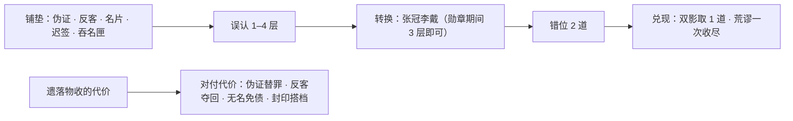

# 技能与遗落物配合 · 封印物版 · 2026-10-03

**设计稿，待评审。** 没有修改规则、奖励、存档或美术。新数值都是候选，没有跑成长模拟和墙关探针。

**依据**

- 两份参考报告和它们的实战截图：[佛堂分析](../../../../docs/reference-analysis/fotang-spells-20261002/佛光与佛堂法术体系设计分析.md)、[佛堂与剑堂融合报告](../../../../docs/reference-analysis/fotang-spells-20261002/佛堂与剑堂融合设计报告.md)、[证据图](../../../../docs/reference-analysis/fotang-spells-20261002/evidence/)。
- 另一会话写的[重设计稿](SKILL_RELIC_REDESIGN_20261002.md)和[三件衔接提案](SKILL_RELIC_INTERPLAY_PROPOSAL_20261002.md)。
- 我 10 月 2 日的五方案稿，在分支 `claude/skill-relic-design-20261002` 上。
- 诡秘之主的公开资料，来源列在文末。
- 本仓当前分支的源码，提交 `758d409`。

**用户要求**：根据这些资料，重新研究技能和遗落物怎么配合；遗落物参考诡秘之主的负面效果。

---

## 0. 结论

1. **骨架不变。** 牌负责制造和兑现破绽：误认 → 张冠李戴转换 → 错位 → 兑现。遗落物负责改写规则，**而且一定要收代价**。新增的一层是三张专门“对付代价”的牌：
   - 伪证烙印：**替罪**，把一部分代价转给敌人；
   - 反客为主：**夺回**送给敌人的东西；
   - 无名宣告：**免债**，开一段代价减半的窗口。
2. **遗落物按诡秘之主的封印物来写。** 每件都有四样东西：和力量同源的负面效果；看得见的使用规律；同一场里越用越糟的“余波”；个别物件还有相克或禁忌。所有代价都在本场结清，无主假面的裂纹仍是唯一的永久代价。
3. **采纳另一会话重设计稿的大部分内容。** 包括：错位按“道”计；双影一道一道取、荒谬一次收尽两种兑现方式；四项联动（勋章冒名、名片无人签收、银扣回礼、迟签签收）；通缉物件的代价；界面和战报口径。
4. **本稿新增：**
   - 伪证替罪；
   - 三种余波：勋章利息、名片规则扩散、盐囊破囊；
   - 两组封印搭档，把另一稿发现的冲突做成设计；
   - 无名免债；
   - 两件新封印物候选：喂养型的吞名匣、交换型的答问镜；
   - 封印档案卡。
5. **第一批只上这些：** 另一稿的四项联动，荒谬一次收尽两道，伪证替罪（只接勋章），勋章利息，名片规则扩散，以及飘字和代价预告。其余放第二批。
6. **更正我上一稿：** 通缉遗落物有独立一栏（`bountyRelicID`），不和普通被动位共用。墙关换通缉物件，不会挤掉普通遗落物。
7. **法术表现要往前打，而且攻击形式要多样**。这是用户 10 月 3 日指出的两个关键，见第 11 节。
   - 参考游戏的法术从主角出发、朝敌人打过去，形式各不相同：弧斩、劈裂、飞剑齐射、召唤火龙、地涌火柱、旋转莲轮。
   - 我们现在的命中华彩层几乎每招都在敌人身上向四周“炸开”，彩虹扇面常常铺满大半屏。
   - 改法：每一招改成“出手 → 推进 → 命中”三段，各有一种不重复的攻击形式。炸开只当命中时的小收尾，只有终极技可以铺满全屏。

---

## 1. 四份资料各拿什么

| 资料 | 拿什么 | 不拿什么 |
|---|---|---|
| 佛堂分析 | 共同状态（灼烧）既是伤害来源，也是别的招的条件。按“铺状态 → 放大 → 引爆 → 转成生存”分工。同一份准备有几种回报 | 高阶倍率暴涨（819% 对 6080%）让旧牌作废；六槽加羁绊的数量门槛 |
| 剑堂报告 | 施放会推动节奏（攻速 → 冷却 → 追加攻击）。“上阵被动”的价值不体现在伤害条上。击杀后给相邻技能减冷却 | 没有上限的概率刷新 |
| 两组实战截图 | 每招有一眼能认出的大主体（莲、塔、龙、紫金火柱、虹桥弧面）。状态和机制直接飘字：“灼烧”“冷却降低”“会心”“招架” | — |
| 另一会话重设计稿 | 错位按道计、两种兑现、四项联动的精确条件、用六个问题写清代价、通缉代价、战报口径、验证计划 | 本稿同意它“不新增全局疯狂值”的决定 |
| 我的五方案稿 | “抢戏”（遗落物进入误认和错位）和“以伤换戏”（代价当燃料）两个思路 | “加演”要先解决“下一张”的可读性；“满堂彩”会多出一套资源 |

---

## 2. 诡秘之主的负面效果

### 2.1 原作里的几种原型

| 原型 | 原作例子 | 规律 |
|---|---|---|
| 喂养 | **蠕动的饥饿**：每天要吃一个活人，否则吞食佩戴者；还会在佩戴者脑中赞颂，带来混乱和头痛 | 不喂就反噬 |
| 交换 | **阿罗德斯**：回答问题之后，要求使用者回答它一个问题，或者接受雷击；有时可以改成完成一个任务 | 先给，后要 |
| 用后虚弱，越用越糟 | **采血器**：提升力量和速度，用后虚弱 12 小时，频繁使用会失智 | 借来的力要还，频繁用会加重 |
| 弱点外露 | **丧钟**：能发现弱点、致命攻击，用后自己产生新弱点，维持 6 小时 | 看穿别人，也被别人看穿 |
| 逐次加重 | **灵界穿梭石手链**：用后在满月听到疯狂呓语，一次比一次重 | 累积 |
| 时限 | **心魇蜡烛**：持有超过 5 分钟会迷失精神 | 超时失控 |
| 改变持有者 | **谎言**：佩戴时情绪被放大；**海之言**：会随意歌唱，性格恶劣 | 物件改变人 |
| 主动加害 | **0 级羽毛笔**：一直尝试把持有者“写”死 | 物件有自己的意志 |
| 相克 | **蠕动的饥饿**怕蘑菇：周围 5 米有蘑菇，就用不了任何能力 | 特定条件下失灵 |
| 提前取用 | **莱曼诺的旅行笔记**：记下非凡能力留到以后用，用后会迷路、遇险 | 提前拿未来的力量，要付代价 |

### 2.2 翻译成雾港的六条规则

1. **同源**：代价和力量是同一回事。借来的命要还，拒收是双向的，封住的是自己的牌。
2. **看得见**：什么时候付、付多少，事前就能看到，包括物件档案卡和战斗中的预告。
3. **会加重**：同一场里用得越多越糟（余波），打完清零。
4. **有禁忌**：少数物件遇到特定敌人或特定搭配会失灵或反咬（相克），要写进档案。
5. **能应对**：可以用牌去转嫁、夺回或减免代价，但都要操作才能成立。普通净化不能抹掉代价。
6. **不跨场追债**：除了假面裂纹，所有代价只在本场。不做离线喂养倒计时，不做跨场累积的疯狂值。

### 2.3 不照搬什么

- 名字和能力都原创；不做吃人之类的残酷设定。
- 原作里“12 小时”“满月”这类真实时间的代价，全部改成本场内。
- 原作里的随机发作（例如海之言随意歌唱）改成有预告的规律。手机上的实时战斗，玩家应付不了没有预告的惩罚。

---

## 3. 配合的骨架

对付代价的四种手段：

| 手段 | 对付什么 | 要付出什么 |
|---|---|---|
| **伪证替罪** | 契约类代价：勋章交还的生命、断线针的封疗 | 伪证必须留在一个活着的敌人身上，而且还没用完。替一次罪，伪证剩下的强化全部清零 |
| **反客夺回** | 银扣送给敌人的回礼盾 | 占用反客为主这一次出手，不能同时去驱散别的增益 |
| **无名免债** | 终极技之后 6 秒内结清的第一笔代价 | 终极每场只有一次，要把借命的结束时间对准它 |
| **封印搭档** | 两件特定遗落物一起装，互相压住对方的一种副作用 | 各自让出一部分收益 |

---

## 4. 技能

| 技能 | 现在（源码） | 本稿 |
|---|---|---|
| 错步穿行，4 秒 | 110%；目标有误认或错位时 137.5%，并让荒谬获得“归结准备”；可打第二目标 | 不变。这个“错步 → 荒谬”的关系要显示出来 |
| 伪证烙印，6 秒 | 70%，+1 层误认；对这名敌人的后两次伤害技能 +15% | **新增替罪**（见 4.1）。“伪证留给自己用还是留着替罪”成为一个取舍 |
| 张冠李戴，8 秒 | 80%；出手前满 4 层就转换成 2 道错位，否则 +1 层 | 采纳另一稿：勋章生效期间 3 层即可转换。和无名宣告的门槛同时生效时取最低，不叠加 |
| 双影追猎，6 秒 | 两段 65%；有错位时第二段 97.5%，用掉 1 道 | 采纳另一稿：显示“取一道” |
| 荒谬归结，12 秒 | 150%；有错位再 +80% 并清空；归结准备 +25%；穿甲 30%（源码目前不论有没有错位都给） | 采纳另一稿：一次收尽两道时额外 +30%；穿甲改成只在有错位时给，让说明和源码一致 |
| 反客为主，10 秒 | 驱散一个防御增益成功，给 1 道错位；没有增益时 +2 层误认 | 采纳另一稿：认得出自己银扣送出的回礼盾，夺回剩余部分 |
| 无名宣告，每场一次 | 全体 4 层误认，并获得归结准备 | **新增免债**（见 4.2） |

### 4.1 伪证替罪

- **带伪证**：敌人身上伪证的强化还剩至少 1 次。
- **能转嫁的代价**：只有契约类。第一批只接勋章交还的生命，第二批再接断线针的封疗。
- **不能转嫁的代价**：物理类或永久类，包括假面裂纹、盐囊封存的上限、镇纸封掉的牌、铜锚首击的加伤、名片让你打空的伤害。银扣回礼由反客为主处理，不走替罪。
- **勋章怎么替**：勋章结束交还生命时，如果场上有带伪证、而且活着的敌人，交还量的一半改由它承担，作为真实伤害，最多 15% 入场生命（H0）。优先当前目标；当前目标不带伪证时，选伪证剩余次数最多的敌人。然后这名敌人的伪证强化清零，主角只交剩下的部分。
- **断线针怎么替（第二批）**：6 秒封疗改成主角 3 秒；带伪证的敌人在那 3 秒里也不能接受外来治疗。
- **次数**：一个伪证只能替一次罪；一次结算只走一种减免。
- **结算顺序**：先按余波算出交还比例；再在替罪和免债里选对玩家更有利的一种（两者不叠加）；最后扣血。
- **取舍**：伤害牌打这名敌人时会用掉伪证的强化。想留着替罪，就把伪证打在副目标身上，主攻另一个；或者在勋章快结束时补一次伪证（冷却 6 秒）。

### 4.2 无名免债（第二批）

- 无名宣告施放后的 6 秒里，**第一笔**结清的遗落物代价减半。只对勋章交还和断线针封疗生效。
- 这 6 秒里发动的勋章，不计入利息次数。
- 不和替罪叠加，取更有利的一种。

### 4.3 两种兑现方式

采纳另一稿第五节的算例。目标有 2 道错位时有两种打法：

- 先双影取一道，再荒谬收另一道，系数合计 392.5%；
- 先荒谬一次收尽两道（加 30%），再打一个没有强化的双影，合计 390%。

两种总量接近，但伤害到达的时间不同。先荒谬适合抢在短破绽里，先双影适合持续输出。真实的防御、穿甲和出手时点都会改变排序，必须复跑。

---

## 5. 封印档案（十件普通遗落物）

**编号规则**：前缀是收管它的教会，取三教会的暂定名（守灯会管守护与承担风险、观镜会管目标与误认、缄卷会管封存与延迟）。等级分三档：甲（危险）、乙（有风险）、丙（较安全）。剧情物件由个人持有，不编号。收益和代价沿用序列 9 契约。“采纳”指另一稿的设计，“新增”是本稿的设计，都是候选。

### 无主假面 · 个人持有 · 甲级 · 主动

- **使用**：手动，4 秒内承接最多两次直接攻击；持续伤害无效，也不消耗次数；冷却 18 秒。
- **负面效果**：每用一次永久添一道裂纹，十道后失效，第十次仍然有效；Q3、Q4 教学不计。
- **余波**：无。这是用户定下的契约，不追加惩罚。
- **配合**：挡住转换和兑现前的危险时段；照常触发幻身天赋（护幕、回声、缝影、镜幕反奏）。
- **可选（待定）**：“认错人”。挡下一个有 2 层以上误认的敌人的攻击时，把它的误认换成 1 道错位。
- **守则**：它记得每一次。别在毒雾里、或敌人没出手时戴上它。
- **叙事**：裂纹到 3、6、9 道时，面具说一句话。只是文字，不带效果。

### 僭命勋章 · 个人持有 · 甲级 · 主动

- **使用**：8 秒内当前生命和生命上限 ×1.5，攻击 ×1.3；冷却 24 秒；和假面只能二选一。
- **负面效果**：结束时交出剩余生命的一半，原型是采血器。
- **余波（新增）**：**利息**。同一场第一次借交 50%，第二次 60%，第三次起 70%。打完清零；图标显示下一次的比例。
- **配合（采纳）**：**冒名**。勋章生效期间，张冠李戴 3 层就能转换。
- **配合（新增）**：**替罪**，交还量的一半由带伪证的敌人承担，最多 15% H0。**免债**（第二批）。
- **可选（待定）**：**傲慢**，原型是“谎言”。生效期间不能换目标。会让勋章更难用。
- **守则**：借之前，先看八秒后谁要出重击。

### 空栏名片 · 观 2-03 · 乙级 · 主动

- **使用**：主动 3 秒，与一个固定敌人互相拒收直接伤害；冷却 18 秒；自己的牌照常消耗。
- **负面效果**：规则对双方都生效，你也打不中它。
- **余波（新增）**：**规则扩散**。同一场第三次起，名片把你的名字也抹掉：3 秒内所有敌人都打不中你，你也打不中任何敌人，自动出牌照常消耗，这次不发“无人签收”。图标显示已经递出几次。
- **配合（采纳）**：**无人签收**。窗口内实际拒收到一次正值直接伤害，窗口自然结束时给那个敌人 +2 层误认。
- **配合（第二批）**：和迟签印章组成搭档“守约”（第 6 节）。
- **守则**：递之前想清楚这三秒你打谁；第三次递出去，就收不回来了。

### 迟签印章 · 缄 3-05 · 丙级 · 被动

- **使用**：下一张伤害技能的一笔直接伤害延后 3 秒，追加 min(原伤 40%, 15% H0)；一次只开一张票；冷却 12 秒。
- **负面效果**：当下少了一笔伤害。到期时目标已经离场，或者正处于真免伤，这张票作废。
- **改动（第二批）**：**转签**。目标先死了，这张票按一半转给当前选中的敌人；没有选中的，就给第一个还活着的敌人。真免伤仍然作废，转签不触发签收。理由是减少作废带来的随机感：契约总要有人收。
- **配合（采纳）**：**签收**。延后的那笔实际造成伤害、目标还活着并且有误认时，再 +1 层。
- **相克（第二批候选）**：**怕钟**。钟匠校准期间不能开新票。
- **守则**：别给快死的人签。

### 盐封呼吸囊 · 守 3-07 · 丙级 · 被动

- **使用**：收容 60% 的毒跳伤害，容量是 H0。
- **负面效果**：每收容 10 点，封存 1 点正常生命上限，本场不返还。
- **余波（第二批）**：**破囊**。累计收容达到容量时盐囊破开：全体敌人受到 10% H0 盐雾伤害，各 +1 层误认；主角也受到 5% H0；之后本场不再收容。封存的上限不返还。
- **配合**：后手改写在第一章结尾取得，取得后可以减少要收容的毒。破囊带来的误认可以接张冠李戴。
- **守则**：囊快满的时候，要么离开毒雾，要么让它破在敌人脸上。

### 反照墨镜 · 观 2-04 · 乙级 · 被动

- **使用**：锁定 2 秒后，一次普攻改为给目标回血；之后 4 秒内，另一个敌人的一次直击（最多 20% H0）转到这个目标身上。
- **负面效果**：这是交换型，原型是阿罗德斯。先送出去的血不退；中途切换目标会取消。
- **配合（第二批）**：**折射**。成功转伤时，攻击者 +1 层误认，因为它以为打中的是你。
- **守则**：先想好让谁替你挨这一下。

### 缄卷镇纸 · 缄 2-06 · 乙级 · 被动

- **使用**：第三槽的牌就绪时封掉这一次，换 4 秒内一次收容（最多 35% H0）；冷却 18 秒。
- **负面效果**：这是禁忌型。被封的牌全部效果消失，冷却照走。
- **配合（第二批）**：和勋章组成搭档“镇命”（第 6 节）。
- **守则**：第三行永远留白，别把转换牌和反客为主放在第三槽。

### 逆潮铜锚 · 守 3-08 · 丙级 · 被动

- **使用**：同一个敌人的同一个动作首击之后 2 秒内，后面两段共收容最多 35% H0；冷却 10 秒。
- **负面效果**：首击额外多受 5% H0。
- **配合**：保持纯防守，只针对多段攻击（采纳另一稿的原则）。
- **守则**：先挨第一浪。对付单段重击时别带它。

### 归属断线针 · 缄 2-09 · 乙级 · 被动

- **使用**：截取选中敌人收到的外来治疗，给自己，最多 20% H0，且不超过自己的缺血；每场两次，冷却 12 秒。
- **负面效果**：截完之后 6 秒自己不能回血。
- **配合（第二批）**：**替罪**。封疗改成主角 3 秒，带伪证的敌人 3 秒也不能接受治疗。
- **守则**：满血时别截。后手改写解不了这里的封疗。

### 返礼银扣 · 观 3-10 · 丙级 · 被动

- **使用**：收容下一次直接攻击，最多 30% H0。
- **负面效果**：每拒一击，就欠来者一份礼。攻击者获得收容量一半的普通盾；要等 8 秒、并且这面盾被打破后，才能再次就绪。
- **配合（采纳）**：**回礼夺回**。反客为主可以夺回这面盾剩下的部分：主角获得等量普通盾，那个敌人获得 1 道错位。
- **守则**：盾还在的时候去夺；记清楚是谁收了礼。

---

## 6. 余波、相克与封印搭档汇总

| 类型 | 物件 | 规则（候选） | 批次 |
|---|---|---|---|
| 余波 | 僭命勋章 | 利息：同场第二次借交 60%，第三次起 70% | 第一批 |
| 余波 | 空栏名片 | 规则扩散：同场第三次起，所有敌人和你互相打不中 | 第一批 |
| 余波 | 盐封呼吸囊 | 破囊：收满时全场受盐雾，主角也受伤，之后失效 | 第二批 |
| 相克 | 迟签印章 | 怕钟：钟匠校准期间不能开新票 | 第二批 |
| 相克 | 吞名匣（新） | 怕镜刺：同时装着通缉物件借脸镜刺时完全不进食 | 随新物件 |
| 搭档 | 名片＋迟签 | **守约**：票据在名片拒收期间到期的，顺延到窗口结束后立刻结算；那时目标已离场，按转签处理。另一稿指出两者冲突，这里把冲突做成搭配 | 第二批 |
| 搭档 | 勋章＋镇纸 | **镇命**：装着镇纸时勋章利息不涨，一直 50%；镇纸收容上限降到 25% H0 | 第二批 |

---

## 7. 两件新封印物候选

这两件和第一章已有的十件不重复，各自对应一种原作原型。取得节点待定，不改现有奖励。另一稿的“折返路签”（重演一招，下一张推迟）属于“提前取用”型，原型是莱曼诺的旅行笔记，照它的设计保留为候选。

### 吞名匣 · 缄 2-11 · 乙级 · 被动（喂养型）

- **来历**：第 8 关吞名者被封存后的残匣。
- **使用**：每 6 秒进食一次，吃掉当前目标 1 层误认；每吃一次，主角本场伤害 +5%，最多 +25%。
- **负面效果**：进食时当前目标没有误认，就咬持有者：失去当前生命的 4%，伤害加成退一档。
- **相克**：同时装着借脸镜刺（通缉 B08，专门克制吞名）时，完全不进食。
- **配合**：组成“喂名”打法，不靠转换。伪证、反客（没有增益时 +2）、名片（+2）、迟签（+1）都能喂它。它和张冠李戴抢误认，带它的卡栏一般不放转换牌。
- **守则**：别让它饿着。

### 答问镜 · 观 2-12 · 乙级 · 主动（交换型）

- **使用**：手动，对当前目标使用，立刻显示它接下来两次行动；冷却 18 秒。
- **负面效果**：镜子随后提问：6 秒内必须用一张兑现牌（错步、双影或荒谬）命中这个敌人，作为回答；答不上来就受“雷罚”，主角受到 8% H0 真实伤害。
- **配合**：提前知道重击，就能换目标或者先杀掉它。“回答”本身也是一次兑现，所以兑现牌要排在它附近。
- **守则**：问之前，先想好怎么答。

---

## 8. 打法

四张牌都按“已取得”计算；箭头是首轮编排，之后按冷却出牌。

| 打法 | 四张牌 | 主动＋被动 | 用到的配合 | 什么时候好用 | 放弃了什么 |
|---|---|---|---|---|---|
| 蓄势兑现 | 伪证→张冠李戴→双影→荒谬 | 勋章＋迟签 | 冒名、签收、替罪 | 稳定的单个目标 | 没有反客，处理防御增益差 |
| 借命替罪 | 伪证→反客→张冠李戴→荒谬 | 勋章＋断线针 | 冒名、替罪（勋章或断线针，二选一） | 有治疗的敌阵 | 没有双影 |
| 拒收反夺 | 伪证→张冠李戴→反客→荒谬 | 名片＋银扣 | 无人签收、回礼夺回，名片第三次扩散用来保命 | 重击来源清楚的多敌 | 拒收期间直接伤害会打空 |
| 守约连签 | 伪证→张冠李戴→双影→荒谬 | 名片＋迟签 | 守约、签收、无人签收 | 节奏稳定的单体 | 拒收期间少打一些 |
| 镇命 | 伪证→张冠李戴→双影→荒谬 | 勋章＋镇纸 | 镇命，利息不涨 | 长战、要多次借命 | 第三槽的双影经常被封 |
| 喂名（新） | 伪证→反客→错步→双影 | 名片＋吞名匣 | 用误认喂匣子叠伤，不转换 | 没有增益、能持续铺垫的敌阵 | 没有错位兑现 |

另一稿的“转伤牵引”（名片＋墨镜）和“截疗抢杀”保留不变。

---

## 9. 一场示例（Q22，钟匠加守卫）

**配置**：蓄势兑现（伪证→张冠李戴→双影→荒谬，勋章＋迟签）。H0 按 1000 算。按出手先后排，实际调度可能不同。

| 拍 | 发生什么 |
|---|---|
| 1 | 开场选中守卫。伪证打守卫：守卫 1 层误认，**伪证的两次强化留在守卫身上，留着替罪** |
| 2 | 点钟匠换目标。张冠李戴打钟匠：1 层。迟签把这一笔延后 3 秒 |
| 3 | 双影打钟匠，没有错位，两段 65% |
| 4 | 迟签那笔落地，**签收**：钟匠 2 层 |
| 5 | 荒谬打钟匠，没有错位，150% |
| 6 | 第二轮伪证打钟匠：3 层 |
| 7 | 张冠李戴即将出手时**按勋章**：生命 600 → 900，攻击 ×1.3，**冒名**生效 |
| 8 | 张冠李戴 3 层即转换：钟匠 2 道错位，下一次出手延迟 |
| 9 | 双影第二段取一道 97.5%；荒谬收最后一道 230%；两招都吃 ×1.3 |
| 10 | 勋章到期，应交 450。**替罪**：守卫还带着伪证，一半 225，上限 150。守卫受 150 真实伤害，主角交 300，剩 600。守卫的伪证清零 |
| 11 | 再借一次的话，**利息**是 60%。勋章图标上提前显示 |

如果第 1 拍把伪证也打在钟匠身上，钟匠会更早叠到 3 层，但第 10 拍没人替罪，主角要交满 450。这就是“伪证留给自己用还是留着替罪”的取舍。

---

## 10. 显示：飘字、档案卡、战报

**飘字**：照参考游戏的做法，系统事件都直接飘出来。另一稿的状态显示照用，本稿加上物件事件：

- 误认 +1 / +2、转换、错位 ×2、取一道、收尽两道；
- 借命、交还 −300、替罪 −150、利息 60%；
- 拒收、扩散、无人签收；
- 迟签 3 秒、签收、转签、作废；
- 回礼、夺回、破囊、进食、饿咬、答问、雷罚。

**物件图标**：

- 待结清的代价，例如“8 秒后交还约 450”；
- 余波次数，例如“名片已递 2 次”、“下次利息 60%”；
- 搭档是否生效。

**档案卡**：物件详情页按封印档案写，内容包括编号、等级、使用方法、负面效果、守则，再加一句剧情短句。玩家读档案就能学会代价，代价也成了物件身份的一部分。

**战报**：采纳另一稿的口径（第十二节），另加一栏“代价”：

- 交出的生命，以及其中由替罪转出的部分；
- 送出的盾或血；
- 被封的牌；
- 作废和转签的票；
- 被饿咬掉的生命。

---

## 11. 法术表现：往前打，形式各不相同

### 11.1 差别在哪里

| | 参考游戏（佛堂、剑堂实战帧） | 雾港现在（模拟器 169.27 录像） |
|---|---|---|
| 从哪里出发 | 主角身前或脚下 | 敌人身上或屏幕中央 |
| 怎么走 | 沿主角到敌人的方向推进：弧斩扫过去、剑隙劈过去、火龙盘上去 | 原地向四周放射：彩虹扇面、放射光束、彩色纸屑 |
| 攻击形式 | 各不相同：弧斩、劈裂、飞剑齐射、交叉斩、召唤火龙、地涌火柱、旋转莲轮、塔形火焰 | 基本都是在目标身上炸开；招与招只差在炸开的形状、颜色和材质 |
| 占多大 | 主体集中在主角和敌人之间的那一条，两边的场景大多还看得见 | 峰值时铺满大半屏，主角常被盖住 |
| 方向感 | 形状有朝向，留下从主角指向敌人的轨迹 | 没有朝向，看不出是谁打谁 |
| 状态 | “灼烧 −xxx”“冷却降低”这类字跟在敌人或主角身上 | 状态没有贴在目标上 |

对照证据：
- 参考游戏：剑堂第 90 层第 10、12、13、16 秒四帧（虹桥弧面、剑隙、金色弧斩、横斩），佛堂的烛龙焚罪；
- 我们：`docs/development/hero-v4-20261002/sim-169.27-spells.jpg` 里 26.5、37.5、40 秒三帧。

**原因**：命中华彩层（`SpellSpectacle20260926`）只在命中回执那一刻、在目标身上生成。它的形态多是穹顶弧、扇叶、升腾这类往四周铺开的曲面，再按强度加全屏染色，所以没有“从主角打过去”的那一段。它区分招式靠形态、材质、签名、颜色，但这些都是**同一种炸开**的变体，攻击的**形式**本身没有变。

### 11.2 规则

1. **三段**：
   - 出手在主角身前；
   - 推进沿主角到目标的那一条走廊；
   - 命中在目标身上撑开，再明确回收。
   推进用的是出手到命中之间的时间，例如双影 0.705 秒、荒谬 0.885 秒，正好在命中回执那一刻到达。规则层的命中时刻不变。
2. **占多大**：主体只在走廊里，宽度约为屏宽的一半；命中撑开最多到目标周围约一个半身位；**全屏染色只留给终极技**。
3. **有朝向**：用斜斩、直刺、抛物线、追踪这类形状，在走廊里留下从主角指向敌人的轨迹。命中的爆开也朝前，不朝四周。
4. **主角始终看得见**：配合刚做的全身施法，任何时候不盖住主角的轮廓和动作。
5. **状态贴在目标身上**：误认、错位、伪证都显示在目标头顶或脚下，不放在屏幕中央。
6. **多个目标就分成几道**：各自射向自己的目标，不合成一团盖满全场。
7. **每招一种攻击形式，互不重复**：主体决定“怎么打过去”，炸开只能当命中时的收尾，占这一招时长的最后两成左右。

### 11.3 攻击形式

先定“怎么打过去”，再挑材质和颜色。下表是可选的形式，括号里是参考游戏里对应的例子。

| 形式 | 样子 | 适合的语义 |
|---|---|---|
| 突进穿行 | 主角或残影沿地面冲过目标身边，留下一串轨迹 | 位移、穿插、骗过对手 |
| 斩（弧斩、交叉斩、劈裂） | 一道有厚度的刃弧从主角身前扫过目标（剑堂金色弧斩、交叉斩、剑隙） | 挥砍、断开 |
| 投掷 | 一件实物沿抛物线飞向目标，落地有分量 | 道具、证物、印章 |
| 齐射、落雨 | 一群小物件成排射出，或从上方错落砸下（剑堂飞剑） | 多段、压制 |
| 召唤体追击 | 有轮廓的形体自己冲上去、盘绕、咬合（佛堂烛龙） | 影子、分身、野兽 |
| 地涌、柱 | 从目标脚下往上冲出一根柱子（佛堂紫川神火） | 审判、揭穿 |
| 牵引 | 一根线或锁链连住目标，把东西拉过来 | 夺取、拉扯 |
| 落印 | 一枚印记从上方压到目标身上，并且留在那里 | 标记、契约 |
| 置换 | 两件东西在目标身上交换位置 | 换身份、错认 |
| 环绕、护体 | 东西绕着主角转，不打出去（剑堂蓝色龙形护体） | 防御、净化 |
| 横扫全场 | 一整面东西扫过整个场地 | 只给终极技 |

**第一章每招的形式和三段（道具沿用 9 月 30 日技能梳理定的方向）**

| 技能 | 形式 | 出手 | 推进 | 命中 | 状态留在哪 |
|---|---|---|---|---|---|
| 错步穿行 | **突进穿行** | 主角向前踏一步，原地留一个残影 | 残影踩着一串错开的镜面鞋印，从目标身边穿过；有第二目标时拐弯过去 | 穿过的瞬间，目标身上留两道交叉的镜面划痕，碎镜朝前溅 | 不留，这张牌不消耗状态 |
| 伪证烙印 | **投掷＋落印** | 主角甩手掷出封蜡印章 | 印章沿抛物线飞向目标，拖着一道红蜡 | 盖在目标身上，红蜡朝前溅开 | 目标脚下的蜡印，亮到两次强化用完 |
| 张冠李戴 | **置换** | 主角抛出一顶帽子和一块名牌 | 两样东西旋转着飞向目标 | 落到目标头上；满层时帽子和名牌交换，敌人身影向旁错开半个身位 | 头顶名牌上的裂纹（误认层数），错开的人影（错位道数） |
| 双影追猎 | **召唤体追击** | 两道黑紫残影从主角身上剥离 | 一前一后，贴地扑向目标 | 第一道擦过，第二道咬住；取用错位时第二道转成亮红 | 错位少一道 |
| 荒谬归结 | **落雨＋地涌** | 主角用指挥棒指向目标 | 扑克牌、礼帽、断钟针从主角身后沿弧线成排砸向目标 | 一道聚光灯从目标脚下冲起成柱，幕布只在目标两侧合拢；收尽两道时，两个错影折进同一个落点 | 错位清空 |
| 反客为主 | **牵引** | 丝线从主角手中射出 | 射向目标，勾住它的增益光 | 把增益猛地拉回主角身后，方向反过来 | 目标脚下翻倒的椅子，表示错位 |
| 后手改写（第一章结尾取得） | **环绕** | 几页剧本从主角身边升起 | 不打出去，绕主角转一圈 | 红笔划掉一行，纸页贴到下一张牌上 | 主角身上 |
| 无名宣告（终极） | **横扫全场** | 主角身后升起一块黑幕 | 黑幕向前扫过整个舞台，**这是唯一允许满屏的一招** | 所有敌人头顶的名牌烧成空白 | 全体 4 层误认 |
| 普攻（斩、刺、飞牌） | **斩、刺、投掷**，照三套动作轮换 | 跟主角动作走 | 刃弧或飞牌直接打到目标 | 小，不抢技能的戏 | — |

敌人的法术也要照这个规则重新分配形式，例如：
- 石颚：地涌、投掷碎石；
- 猎犬：突进扑咬；
- 钟匠：钟针斩；
- 押运车：横冲。

这一项另做，本稿只定规则。

遗落物的事件也要有方向：

| 事件 | 方向 |
|---|---|
| 勋章借命 | 铜光从勋章流进主角 |
| 勋章交还 | 生命化成铜屑飞回勋章。替罪时，一条红线从勋章连到带伪证的敌人，债沿线飞过去 |
| 名片拒收 | 名片从主角手里飞到目标面前，横在两人之间 |
| 银扣回礼、夺回 | 回礼时银光从主角飞到攻击者身上成盾；夺回时沿原路收回 |
| 迟签 | 票据飞向目标贴住，三秒后盖章 |
| 吞名匣进食 | 一缕墨从目标头顶被吸回匣子 |

### 11.4 怎么验收

每招录模拟器，做到下面三条才算方向对了。这只是验收方向的标准，不代表视觉合格；视觉要用户认可。

- **占屏**：命中峰值那一帧，特效占战斗画面的面积不超过 35%，终极技除外。
- **方向**：出手到命中之间，特效最亮部分的中心从主角移到目标。
- **主角可见**：主角轮廓至少七成可见。
- **形式不重复**：把主角所有技能的推进段各取一帧，拼成一张网格。每一格的攻击形式都不一样；不能有两招都是在目标身上炸开。

数据都从录像帧里量，和不放技能的同机位帧做差。

**改的地方**：
- 推进段：主角施法时放一个沿走廊推进的主体，在命中那一刻到达。主体按上表的攻击形式来做，需要在华彩层的形态、材质、签名之外，再加一个“形式”维度。
- 华彩层：命中时改成朝前的小撑开，普通技能去掉全屏染色。
- Swift 规则和命中时刻都不动。

按 `mistport-spell-spectacle` 的流程先做三招样板：伪证烙印（投掷＋落印）、双影追猎（召唤体追击）、荒谬归结（落雨＋地涌）。三招三种形式，录好后和参考帧并排给用户看，认可后再铺到其他技能和敌人。

---

## 12. 第一批和验证

**第一批**

- 另一稿的四项联动：勋章冒名、名片无人签收、银扣回礼、迟签签收；
- 荒谬一次收尽两道；
- 伪证替罪，只接勋章；
- 勋章利息、名片规则扩散；
- 飘字、代价预告、余波计数。

**第二批**

- 断线针替罪、无名免债；
- 两组搭档：守约、镇命；
- 盐囊破囊，迟签的转签和怕钟，墨镜折射；
- 新物件：吞名匣、答问镜、折返路签；
- 通缉物件的代价（另一稿第十节）。

**验证**：照另一稿第十四节的计划，用真实调度器，复跑 Q8、Q12、Q18、Q22、Q26、Q30 的高、中、低三档，并复用它 20% 的复审线。本稿另加这些检查：

- 替罪上限 15% H0；一个伪证只替一次；替罪和免债不叠加；
- 利息只在本场累计，打完清零；
- 名片第三次扩散期间，规则层不发“无人签收”；
- 守约顺延不会重复结算；
- 吞名匣饿咬的频率在真实调度下是否过高；
- ×2 速度和暂停不改变逻辑结果。

---

## 13. 推荐决定（2026-10-03 由 Claude 代定，用户可随时推翻）

用户要求直接给推荐，不逐条询问。以下按推荐执行：

1. **伪证替罪：采用。** 第一批只接勋章，断线针放第二批。
2. **余波：采用。** 第一批只上勋章利息和名片规则扩散，盐囊破囊放第二批。
3. **勋章“傲慢”：不加。** 勋章已有交半血和利息两重代价；锁目标还会妨碍替罪需要的换目标。
4. **无主假面：不加新效果。** 保持用户定下的十道裂纹契约。
5. **吞名匣、答问镜：第一章不加**，留到第二章。
6. **封印档案卡：采用**，做进物件详情页。
7. **法术往前打、形式不重复：采用，最先做。** 先做伪证烙印、双影追猎、荒谬归结三招样板，在模拟器录给用户看；各招形式按第 11.3 节；敌人的法术等主角样板认可后再改。

**执行顺序**：先做法术样板（只改表现，不碰规则）；再做规则第一批，并复跑墙关。

---

## 14. 评审（2026-10-03，Claude，对照源码）

**和源码一致的部分**

- 牌的系数都对得上 `FoolComboSimulator.swift`：伪证 70%、+1 层、给 2 次 +15%；双影第二段 97.5%；荒谬 150%，有错位 +80%，归结准备 +25%，穿甲 30% 不论有没有错位都给。
- 伪证的强化会被这名敌人身上的**任何**伤害技能用掉，伪证自己除外。状态按敌人分开记，`DungeonScene` 在每个敌人头上显示“伪 n”。所以“伪证留着替罪”这个取舍成立。
- 第 4.3 节两种兑现的算例对（392.5% 对 390%）。算例没计入归结准备和伪证加成，两条路线都会加，排序不变。
- 第 4 节表里没有假面低语，这是对的：它只用于教学，卡组选择里被排除了。

**要改的问题**

1. **名片“规则扩散”现在更像奖励，不像代价。**第三次起，3 秒内所有敌人打不中你。名片冷却 18 秒，所以之后每 18 秒就有 3 秒全免伤。第 8 节“拒收反夺”打法也直接写了拿它保命。这和“遗落物一定收代价”的原则冲突。
   - 建议改成**欠条**：扩散期间敌人的直接伤害不消失，记在名片上，窗口结束时一次性结算一半。图标显示欠了多少。
   - 这样第三次递名片是“先躲、后还”，仍然能救急，但不会白拿。
2. **勋章利息可能很少涨到第三档。**勋章持续 8 秒、冷却 24 秒，一场要打 56 秒以上才借得到第三次。复跑墙关时要统计每场实际借了几次；如果大多数场只借两次，利息实际上就是 50% → 60% 一档，规则可以简化成两档。
3. **荒谬穿甲改成只在有错位时给，是一次削弱。**没有错位时的荒谬会变弱，影响不走转换的打法，比如“喂名”。规则第一批要把它单独列一行做墙关对照，不要和其他改动混在一起看。
4. **替罪伤害按主角的入场生命算。**15% H0 指主角的 H0，对高血量头目只是一小口。说明文字要写清楚“按你的生命计算”，免得玩家以为是按敌人的。

**法术表现（第 11 节）**

正在执行，状态见 [法术形式交接](../../../../docs/development/HANDOFF_SPELL_FORMS_20261003.md)（在 `claude/hero-v4-device-20261001` 分支）。本节规则不变。

---

## 来源

- 起点中文网《诡秘之主》神奇物品词典（蠕动的饥饿、采血器、丧钟、灵界穿梭石手链、心魇蜡烛、谎言、海之言、莱曼诺的旅行笔记等）：https://m.qidian.com/dictionary/shenqiwupin/
- 萌娘百科“阿罗德斯”“非凡物品”（阿罗德斯的问答交换、蠕动的饥饿怕蘑菇、0 级羽毛笔、封印物分级）。页面不能直接抓取，内容取自搜索摘要：https://zh.moegirl.org.cn/%E9%98%BF%E7%BD%97%E5%BE%B7%E6%96%AF 、https://zh.moegirl.org.cn/%E9%9D%9E%E5%87%A1%E7%89%A9%E5%93%81
- 本仓源码，提交 `758d409`：
  - `FoolComboSimulator.swift`：误认每层 +4%，转换给 2 道错位，双影用 1 道，荒谬清空，错步给归结准备，荒谬穿甲目前不论有没有错位都给；
  - `BountyRelics.swift` 和 `ChapterOneEncounterRuntime.swift`：通缉物件独立一栏 `bountyRelicID`；
  - `ChapterOneRelicContracts.swift`：七件被动、三件主动，盐囊收容 60%、容量 100% H0，银扣回礼 50%。
